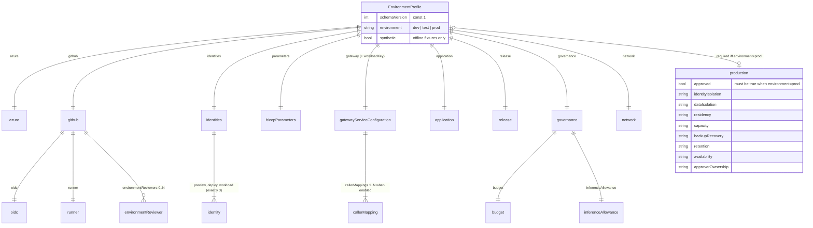
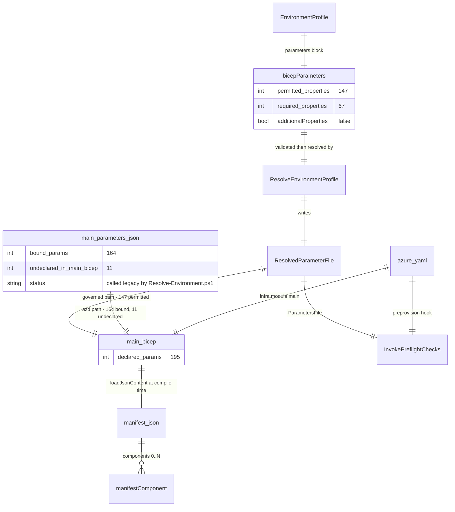
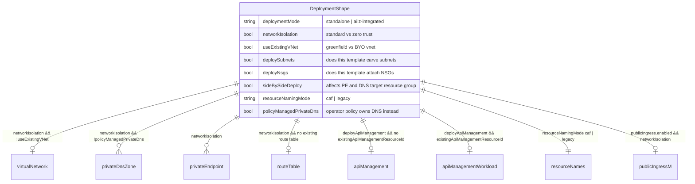
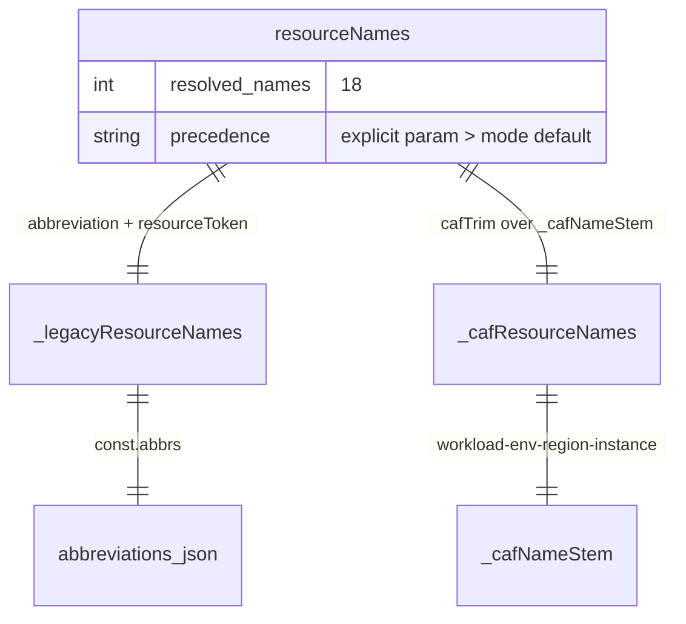
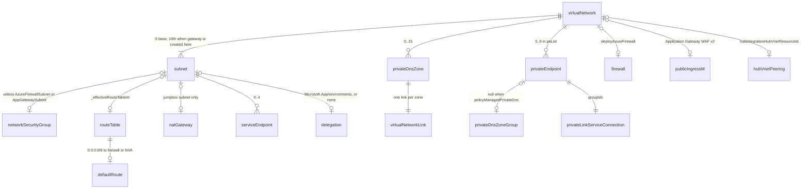
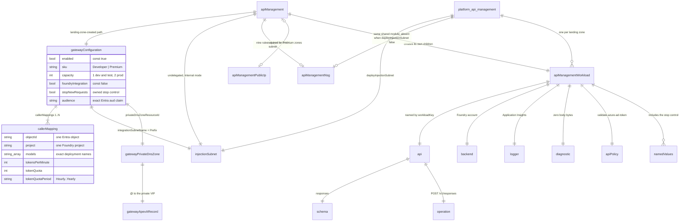
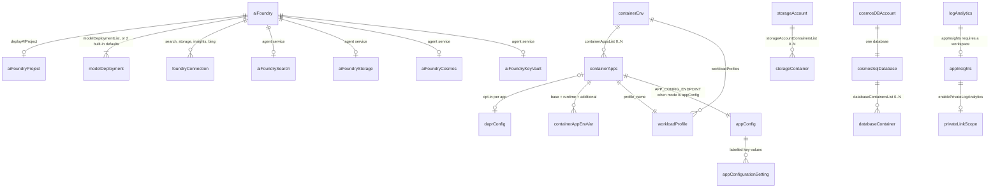
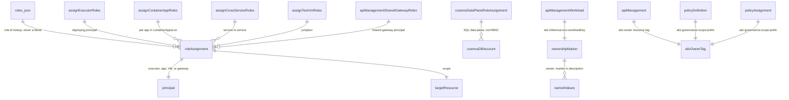
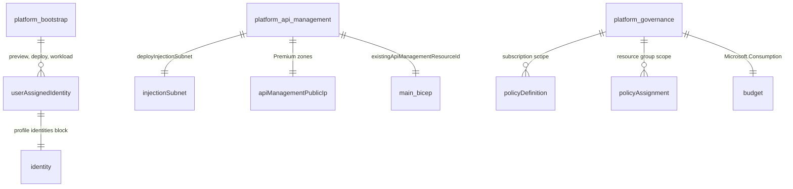

# Template domain model (ERD)

**Status:** Descriptive. Records the template as it stands, not a proposal.
**Date:** 2026-09-22
**Derived from:** branch `feature/apim-platform-separation`, HEAD `c00bb92`
**Companion:** `docs/adr/2026-09-22-apim-classic-vnet-injection.md`

## What this is

`brother-bicep-ptn-aiml-landing-zone` has a large, richly-typed configuration
surface — a 38 KB environment-profile JSON Schema, a 17 KB parameter file,
per-module Bicep user-defined types, and several data-driven resource lists —
and no single artifact showing how those pieces relate. This is that artifact.

The entities modelled here are **this template's own configuration and
deployment entities**: parameters, contracts, lists, and the Azure resources the
template composes from them. They are not application entities. Nothing about
any particular workload's data belongs in this document.

**Scope boundary.** This model describes this repository only. It deliberately
carries no context from any customer workload delivery built on a different
pinned upstream accelerator; those have application entities, this has landing
zone configuration entities, and mixing the two produces a model that describes
neither.

### Method and limits

Derived **offline and read-only** from template source. No Azure subscription
was available, so **no deployment, no What-If, no live resource inspection, and
no ARM validation** informed this model. Every relationship below was read out
of the Bicep, the JSON Schema, and the PowerShell resolver. A relationship that
holds in source can still be wrong about Azure's runtime behaviour, and
§"Where the model and the code disagree" records the places where that gap is
known to matter.

Where `AGENTS.md` requires documentation to track shipped Bicep behaviour and
this document disagrees with the code, **the code wins** — the disagreement is
reported in §"Where the model and the code disagree" rather than quietly
resolved in the diagram.

### Reading the diagrams

Mermaid entity identifiers cannot contain `.` or `/`, so entity names fall into
three classes. **Check the class before grepping** — not every name is a source
symbol, and the ones that are not could not be, because the template does not
give them names.

| Class | Greppable? | Examples |
|---|---|---|
| **Source symbol** — schema definition, Bicep user-defined type, parameter, variable, or module/resource symbolic name, spelled exactly | Yes, verbatim | `bicepParameters`, `gatewayConfiguration`, `callerMapping`, `containerAppsList`, `resourceNames`, `apiManagementWorkload`, `api`, `backend`, `apiPolicy` |
| **Path artifact** — separators replaced by `_` | Grep the real path | `main_bicep` → `main.bicep`, `main_parameters_json` → `main.parameters.json` |
| **Composite** — an Azure or modelling concept the template never names | No | `subnet`, `privateDnsZone`, `roleAssignment`, `ownershipMarker`, `DeploymentShape`, `serviceEndpoint` |

Composites exist because the template expresses those concepts as array
elements, loop bodies or property values rather than as named symbols. Measured
across the nine diagrams: **68 of 105 entity names are exact source symbols, 23
are composites** (all listed in §11.8), and 14 are path artifacts or modelling
devices. The table beneath each diagram gives the exact source location and is
authoritative wherever a name is ambiguous.

Cardinality is Crow's foot: `||` exactly one, `|o` zero or one, `|{` one or
more, `o{` zero or more.

---

## 1. Context map

Seven bounded contexts. Each is a separate diagram below, because a single
diagram covering all of them is not reviewable in a pull request.

| # | Context | Owns |
|---|---|---|
| 2 | Environment profile contract | The governed operator input surface |
| 3 | Parameter surfaces | How input reaches `main.bicep` — **two distinct paths** |
| 4 | Deployment-shape forks | Where the topology branches |
| 5 | Networking | VNet, subnets, NSGs, DNS, private endpoints |
| 6 | Gateway (API Management) | Both gateway creation paths |
| 7 | Foundry, data, and runtime | Foundry account, associated resources, apps |
| 8 | Ownership and RBAC | Role assignments and ownership markers |

Context 9 covers `platform/`, which deploys at a different scope and is not part
of the landing zone deployment at all.

---

## 2. Environment profile contract

`environments/schema.json` defines a **GitHub private developer environment
profile**, `schemaVersion` 1. It is a closed contract: `additionalProperties`
is `false` at the root and in every nested object, so an unrecognised key is a
validation failure rather than a silent pass-through.



| Entity | Source |
|---|---|
| `EnvironmentProfile` | `environments/schema.json` root; instances `dev.example.json`, `test.example.json`, `prod.example.json` |
| `bicepParameters` | `environments/schema.json#/definitions/bicepParameters` |
| `gatewayServiceConfiguration` | `environments/schema.json#/definitions/gatewayServiceConfiguration` |
| `callerMapping`, `identity` | `environments/schema.json#/definitions` |

Two conditional rules carry real weight and are not visible from the property
list alone:

- **`production` is conditionally required.** The root `allOf` requires the
  `production` block when `environment` is `prod`, *and* pins
  `production.approved` to `const: true`. A production profile cannot validate
  while unapproved.
- **`callerMappings` is conditionally non-empty.** When `gateway.enabled` is
  `true`, `callerMappings` gains `minItems: 1`. An enabled gateway with no
  authorised caller is not a valid profile.

The three `*.example.json` files are **deliberately unresolved** — nearly every
leaf is `null`. The schema description says so explicitly. They document shape,
not values, and cardinality here was therefore read from the schema rather than
from the examples. The two places the examples do carry values are the gateway
tier and capacity, which match the ADR: `dev` and `test` are `Developer` at
capacity 1, `prod` is `Premium` at capacity 2.

---

## 3. Parameter surfaces — two paths, not one

This is the most consequential relationship in the repository and the one most
likely to be misread. **There are two different parameter-composition paths, and
they produce files with the same name.**



| Entity | Exact source |
|---|---|
| `main_bicep` | `main.bicep` |
| `main_parameters_json` | `main.parameters.json` (repository root) |
| `ResolvedParameterFile` | `main.parameters.json` written into an explicit output directory |
| `ResolveEnvironmentProfile` | `Resolve-EnvironmentProfile` in `scripts/github/Environment.psm1`, driven by `scripts/github/Resolve-Environment.ps1` |
| `InvokePreflightChecks` | `scripts/Invoke-PreflightChecks.ps1` |
| `azure_yaml` | `azure.yaml` |
| `manifest_json` | `manifest.json` |

### The measured nesting

Counted from source, not estimated:

| Surface | Count | Relationship |
|---|---|---|
| `main.bicep` `param` declarations | **195** | the full contract |
| `main.parameters.json` bindings | **164** | 153 valid + **11 undeclared** |
| `bicepParameters` permitted properties | **147** | a strict subset of the 195 |
| `bicepParameters` required properties | **67** | |

**All 147 schema properties are declared in `main.bicep`.** The governed path is
clean. **11 of the 164 azd bindings are not.** See §10.

Forty-two declared parameters are never bound by `main.parameters.json` and take
their Bicep defaults — including `vnetAddressPrefixes`, all nine
`*SubnetName`/`*SubnetPrefix` pairs, `apiManagementWorkloadKey`,
`existingApiManagementResourceId`, and `existingApiManagementPrincipalId`.
Twenty-eight of those forty-two *are* permitted by the schema, so the governed
path can set them even though the azd path does not.

`Resolve-Environment.ps1` refuses to write into the repository root, with the
reason stated in its own error text: *"legacy main.parameters.json is read-only
to this path"*. The word **legacy** is the repository's own, and it is the
clearest available signal about which of the two surfaces is authoritative.

---

## 4. Deployment-shape forks

The template is not one topology. Four independent forks change which entities
exist. They are modelled here as one `DeploymentShape` entity because they are
read from the same parameter set and evaluated together.



| Computed variable | `main.bicep` line | Meaning |
|---|---|---|
| `_networkIsolation` | 1077 | Zero Trust / network-isolated mode |
| `_createApiManagement` | 1269 | `deployApiManagement && !_hasExistingApiManagement` |
| `_hasExistingApiManagement` | 1268 | `existingApiManagementResourceId` supplied |
| `_deployPrivateDnsZones` | 1227 | `_networkIsolation && !policyManagedPrivateDns` |
| `_createRouteTable` | 1197 | `_networkIsolation && !_hasExistingRouteTable` |
| `_publicIngressEnabled` | 1413 | also requires Container Apps and a non-empty `containerAppsList` |

### The ownership boundary is a relationship, not an attribute

`useExistingVNet`, `deploySubnets` and `deployNsgs` interact, and the
interaction creates a real ownership split that the template documents in a
comment at `main.bicep:1522` and surfaces at runtime as the `injectionNsgManaged`
gateway fact:

| `useExistingVNet` | `deploySubnets` | `deployNsgs` | Subnets created by | Generic per-subnet NSGs | Purpose-built NSGs |
|---|---|---|---|---|---|
| `false` | — | `true` | AVM `virtualNetwork`, inline | **never** | bastion, App Gateway, APIM injection |
| `false` | — | `false` | AVM `virtualNetwork`, inline | **never** | App Gateway, APIM injection only |
| `true` | `true` | `true` | `virtualNetworkSubnets` | created and attached | bastion, App Gateway, APIM injection |
| `true` | `true` | `false` | **nobody** — module not instantiated | none | App Gateway, APIM injection only |
| `true` | `false` | — | **the operator** | **the operator** | **none** — gateway still deployed, its NSG is the operator's |

Three things in that table are easy to get wrong:

- **`deployNsgs` gates subnet creation, not just NSGs.**
  `main.bicep:1579` instantiates `virtualNetworkSubnets` only when
  `_networkIsolation && useExistingVNet && deploySubnets && deployNsgs`. Setting
  `deployNsgs: false` on a BYO virtual network therefore creates **no subnets
  either**. The template carries a dedicated fact for exactly this combination
  at `main.bicep:1047`:
  `existingSubnetNsgAssociationsAreProtected: !(networkIsolation && useExistingVNet && deploySubnets && !deployNsgs)`.
- **The generic per-subnet NSG loop never runs on greenfield.**
  `modules/networking/subnets.bicep` has exactly one call site — `main.bicep:1579`,
  gated on `useExistingVNet`. On the greenfield path `main.bicep` hands `subnets`
  straight to the AVM `virtual-network` module, so `nsgsM` and its
  `invalidNsgSubnets` exclusion list (`AzureFirewallSubnet`, `AppGatewaySubnet`)
  are unreachable. On greenfield the only NSGs are the three purpose-built ones,
  and of those only the bastion NSG consults `deployNsgs`.
- **The last row is the ownership boundary that matters.** With a BYO virtual
  network and `deploySubnets: false`, **the gateway is still deployed** — into a
  subnet this template neither creates nor attaches an NSG to. That pre-existing
  subnet must already be undelegated and must already carry the exact nine-rule
  injection rule set, or the gateway fails to provision. The template cannot
  enforce this, says so at `main.bicep:1522`, and reports which side owns it
  through the `injectionNsgManaged` gateway fact.

### Naming resolves in three layers

`resourceNames` (`main.bicep:936`) resolves **18 resource names**, each through
the same three-layer expression: an explicit parameter overrides everything; a
CAF stem applies when `resourceNamingMode` is `caf`; otherwise the legacy
abbreviation-plus-token form applies. The explicit override is ignored only when
it is *exactly equal* to the legacy default while in CAF mode — which is how the
template distinguishes "operator set this deliberately" from "the default
propagated through".



---

## 5. Networking



| Entity | Source |
|---|---|
| `subnet` / `baseSubnets` | `main.bicep:1430` (`baseSubnets`), `main.bicep:1563` (`subnets`) |
| `networkSecurityGroup` | `modules/networking/network-security-group.bicep` (empty rule set, reachable only via `subnets.bicep`), `bastion-nsg.bicep`, `appgw-nsg.bicep`, `api-management-injection-nsg.bicep` |
| `privateDnsZone` | `_dnsZonesList`, `main.bicep:2084` |
| `privateEndpoint` | `_peList`, `main.bicep:2176` |
| `routeTable` | `main.bicep:1420` |

### Counts, read from source

- **9 base subnets.** The template names them by parameter, not by literal, so
  grep the parameter rather than the diagram's composite `subnet` entity:

  | Name parameter (`main.bicep:208-216`) | Default value | Delegation |
  |---|---|---|
  | `agentSubnetName` | `agent-subnet` | `Microsoft.App/environments` |
  | `peSubnetName` | `pe-subnet` | none |
  | `gatewaySubnetName` | `gateway-subnet` | none |
  | `azureBastionSubnetName` | `AzureBastionSubnet` | none |
  | `azureFirewallSubnetName` | `AzureFirewallSubnet` | none |
  | `azureAppGatewaySubnetName` | `AppGatewaySubnet` | none |
  | `jumpboxSubnetName` | `jumpbox-subnet` | none |
  | `acaEnvironmentSubnetName` | `aca-environment-subnet` | `Microsoft.App/environments` |
  | `devopsBuildAgentsSubnetName` | `devops-build-agents-subnet` | none |

  A **10th** is appended — the API Management injection subnet, named from
  `apiManagementConfiguration.integrationSubnetName` — only when
  `_createApiManagement`. Note that `gatewaySubnetName` is a distinct,
  separately named subnet and is *not* the API Management injection subnet.
- **Up to 15 private DNS zones**, each with exactly one virtual network link.
  Eight are gated only by BYO suppression; Container Apps and ACR additionally
  require their own deploy flags; five more appear only when the Azure Monitor
  Private Link Scope is deployed. Each has a matching
  `existingPrivateDnsZone*ResourceId` parameter that suppresses creation and
  substitutes a BYO zone — 15 parameters, 15 zones, one to one.
- **Up to 9 private endpoints** in `_peList`: storage, Cosmos DB, Search,
  Foundry Search, Key Vault, App Configuration, Container Apps environment,
  Container Registry, Speech. The Private Link Scope endpoint is deployed
  separately by `privateEndpointPrivateLinkScope` and is not in the list.

**`_peList` contains no API Management entry, and that is deliberate.** A
classic VNet-injected instance cannot hold a private endpoint. Its private
access relationship is modelled in context 6 instead.

Only two subnets carry a delegation, both `Microsoft.App/environments` with that
exact casing: `agentSubnet` and `acaEnvironmentSubnet`. The capitalisation is
load-bearing — `main.bicep` records that a lowercase `app` causes capability
host creation to fail roughly 47 minutes into a provision.

---

## 6. Gateway (API Management)

Both creation paths are retained, and **both are classic VNet injection in
Internal mode** on every tier. Passing `existingApiManagementResourceId` selects
the shared platform gateway; omitting it creates one in the landing zone.
Brother always passes it, giving one gateway per subscription, but the template
supports both and both are modelled.



| Entity | Source |
|---|---|
| `gatewayConfiguration` | `modules/api-management/types.bicep` (sealed Bicep UDT) |
| `apiManagement` | `modules/api-management/main.bicep` |
| `apiManagementWorkload` and its children | `modules/api-management/workload.bicep` — the child entities are its own `resource` symbols: `namedValues:73`, `backend:86`, `logger:102`, `api:117`, `schema:131`, `operation:140`, `diagnostic:160`, `apiPolicy:177` |
| `apiManagementNsg` | `modules/networking/api-management-injection-nsg.bicep` |
| `apiManagementPublicIp` | `modules/networking/api-management-public-ip.bicep` |
| `platform_api_management` | `platform/api-management/main.bicep`, `network.bicep` |

### What the diagram is asserting

- **The NSG module is shared across both paths.** `main.bicep:1543` and
  `platform/api-management/network.bicep:92` both instantiate
  `modules/networking/api-management-injection-nsg.bicep`. That sharing is the
  mechanism preventing the two paths from drifting apart, and it is why the
  module is drawn once with two incoming relationships rather than duplicated.
  Both edges are `o|`, for the same structural reason: each path deploys the
  gateway unconditionally but the NSG conditionally. On the landing zone,
  `main.bicep:1543` is gated on
  `_createApiManagement && (!useExistingVNet || deploySubnets)`. On the platform,
  `platform/api-management/main.bicep:244` deploys the gateway with **no**
  condition, while `:218` gates `network.bicep` on `deployInjectionSubnet` —
  documented at `:170` as *"Set false when the platform team owns the injection
  subnet and its NSG outside this template."* Either path can therefore produce a
  gateway whose NSG belongs to somebody else, which is exactly what the
  `injectionNsgManaged` fact (`main.bicep:4268`) exists to report.
- **The injection subnet is undelegated.** Classic injection requires it. The
  subnet is the only one in the template that carries four service endpoints —
  Storage, Sql, KeyVault, EventHub — because the landing zone force-tunnels
  `0.0.0.0/0` to a hub firewall.
- **Private access is a DNS A record, not a private endpoint.** The
  `gatewayPrivateDnsZone` is service-scoped: `<gateway-name>.azure-api.net`,
  holding an apex `@` A record pointing at the gateway's private VIP. The schema
  enforces this shape and rejects the two wrong ones — `privatelink.azure-api.net`
  is excluded by an explicit `not`, and the apex `azure-api.net` cannot match the
  `[a-z0-9-]+\.azure-api\.net` pattern. `publicNetworkAccess` is `Enabled` and is
  the only legal value on an injected instance; privacy comes from Internal mode.
- **`apiManagementWorkload` is keyed by `workloadKey`, not by environment.**
  Every child resource name derives from
  `owner = 'ailz-inference-<environmentName>-<workloadKey>'`. This is what lets
  several landing zones share one gateway without colliding. The schema makes
  the reason explicit: `workloadKey` must not be derived from subscription plus
  environment plus location, because two landing zones sharing all three would
  then collide.
- **`apiManagementWorkload` deploys at the *gateway's* resource group scope**,
  which on the shared path is not the landing zone's resource group. Role
  assignments are deliberately excluded from that module — they target the
  landing zone's own Foundry account and Application Insights, so they stay at
  the landing zone scope (see context 8).

### A modelling collapse, stated

The landing-zone-created path is drawn as `apiManagement ||--|| apiManagementWorkload`
— exactly one. That is true of a single deployment: `modules/api-management/main.bicep`
instantiates `workload.bicep` once. The shared platform path is drawn
`||--o{` because one platform gateway serves many landing zones, but **each
landing zone deployment still contributes exactly one** `apiManagementWorkload`.
The `o{` expresses an accumulation across deployments, not a loop within one.

---

## 7. Foundry, data, and runtime



| Entity | Source |
|---|---|
| `aiFoundry` | `modules/ai-foundry/main.bicep`, wired at `main.bicep:2402` |
| `aiFoundrySearch` / `aiFoundryStorage` | `main.bicep` modules `searchServiceAIFoundry`, `aiFoundryStorageAccount` |
| `aiFoundryCosmos` / `aiFoundryKeyVault` | `modules/ai-foundry/foundry/modules/cosmosDb.bicep`, `keyVault.bicep` |
| `containerApps` | `main.bicep:2934`, AVM `avm/res/app/container-app:0.18.1` |
| `cosmosSqlDatabase` | `modules/cosmos-db/sql-database.bicep` |
| `appConfigurationSetting` | `modules/app-configuration/app-configuration.bicep` |

### The four associated resources have two different owners

All four are gated by `_deployAiFoundryAgentService`
(`deployAiFoundry && deployAAfAgentSvc`), and each has a BYO escape hatch. But
they do **not** share a creation owner, and the diagram's uniform `||--o|` hides
that. Stated here instead:

| Resource | BYO parameter | Created by, when not BYO |
|---|---|---|
| AI Search | `aiSearchResourceId` | **`main.bicep`** — `searchServiceAIFoundry` |
| Storage | `aiFoundryStorageAccountResourceId` | **`main.bicep`** — `aiFoundryStorageAccount` |
| Cosmos DB | `aiFoundryCosmosDBAccountResourceId` | **the nested Foundry module** |
| Key Vault | `keyVaultResourceId` | **the nested Foundry module** |

The mechanism is visible in `main.bicep:2508–2541`. For Search and Storage,
`existingResourceId` is always populated — with either the BYO id or the id of
the resource `main.bicep` just created — so the nested module never creates
them. For Cosmos DB and Key Vault, `existingResourceId` is `null` unless BYO,
which is the nested module's signal to create one. This asymmetry is why
`_deployAiFoundrySearch` and `_deployAiFoundryStorage` exist as variables while
no `_deployAiFoundryCosmos` does.

**This is a structural fact, not a defect.** The two pairs are not equivalent
things. Search and Storage have landing-zone-level counterparts that exist
independently of the agent service — `deploySearchService`,
`deployStorageAccount`, their own name parameters and their own private-endpoint
entries — so `main.bicep` already owns that class of resource and creates the
Foundry instance the same way. Cosmos DB and Key Vault, in the agent-service
role, back thread and connection state that only the Foundry module consumes, so
it creates them. The model records who creates what because an ERD that showed
all four hanging off `aiFoundry` identically would send a reader to the wrong
file.

### `containerAppsList` is the least-typed entity in the model

It is declared `param containerAppsList array` with no user-defined type and no
JSON Schema definition — the schema permits it only as
`{"type": "array", "items": {"type": "object"}}`. Its real shape has to be read
from the consuming expressions. Fields the template actually reads:

| Field | Required | Read at |
|---|---|---|
| `service_name` | yes | name fallback, Dapr `appId` |
| `canonical_name` | yes | App Configuration key prefix |
| `profile_name` | yes | `workloadProfileName` |
| `external` | yes | `ingressExternal` |
| `name` | may be empty | generated when empty |
| `target_port` | optional | defaults to `8080` |
| `dapr` | optional | `{enabled, appId, appPort, appProtocol, enableApiLogging}` |
| `managedIdentity` | optional | `{resourceId}` |
| `registry`, `image`, `environmentVariables` | optional | preserve a deployed artifact across updates |

`app.target_port` defaults to `8080` for both ingress and Dapr, and `AGENTS.md`
treats that fallback as a compatibility contract.

---

## 8. Ownership and RBAC

Grants are never implicit. `modules/security/` centralises them so that every
role assignment is an explicit, reviewable edge.



| Entity | Source |
|---|---|
| `roleAssignment` | `modules/security/resource-role-assignment.bicep` |
| `cosmosDataPlaneRoleAssignment` | `modules/security/cosmos-data-plane-role-assignment.bicep` |
| `roles_json` | `constants/roles.json` — 325 named built-in role definitions |
| `ownershipMarker` | `workload.bicep` `owner` variable and `marker` description |
| `ailzOwnerTag` | `modules/api-management/main.bicep:72`; `platform/policy/contracts.bicep:105,128` |

**Three** ownership mechanisms coexist and should not be confused:

- **Azure RBAC role assignments**, via `resource-role-assignment.bicep`, reading
  role IDs from `constants/roles.json` by name.
- **Cosmos DB SQL data-plane assignments**, via
  `cosmos-data-plane-role-assignment.bicep`. These are a separate Cosmos-native
  mechanism, not Azure RBAC, which is why they have their own module and their
  own call sites.
- **The `ailz-owner` resource tag**, which is how the template claims a resource
  it did not necessarily create in the same deployment. It carries two distinct
  value namespaces:

  | Tagged by | Value shape | Source |
  |---|---|---|
  | Gateway | `ailz-inference-<environmentName>-<workloadKey>` | `modules/api-management/main.bicep:72` |
  | Policy **definition** | `ailz-governance:<scope>:<prefix>` | `platform/policy/contracts.bicep:105` |
  | Policy **assignment** | `ailz-governance:<scope>:<prefix>` | `platform/policy/contracts.bicep:128` |

  The tag is not decorative. `platform/policy/Governance.psm1` performs
  read-before-write against it and **throws on an ownership conflict** rather
  than overwriting a resource another owner claims. Budgets are the documented
  exception — they cannot carry a tag, so owned policy-assignment metadata is
  used as the anchor instead, and a pre-existing budget without that anchor is
  treated as a conflict (`Governance.psm1:71-73`).

The shared-gateway path adds `apiManagementSharedGatewayRoles`, conditional on
`deployApiManagement && _hasExistingApiManagement && !empty(_apiManagementPrincipalId)`.
The gateway's principal ID is passed **as a parameter** and never read off an
`existing` reference, because the gateway may live in another subscription.

---

## 9. Platform scope

`platform/` is not part of the landing zone deployment. It deploys separately,
partly at subscription scope, and produces the resources a landing zone then
consumes by resource ID.



| Entity | Source | Scope |
|---|---|---|
| `platform_bootstrap` | `platform/bootstrap.bicep` | resource group |
| `platform_api_management` | `platform/api-management/main.bicep` | resource group |
| `platform_governance` | `platform/governance.bicep` | **subscription** |
| `policyDefinition` | `platform/policy/definitions.bicep` | **subscription** |
| `policyAssignment` | `platform/policy/assignments.bicep` | resource group |

Three custom policies ship with the template:
`platform/policy/deployment-skus.policy.json`,
`exact-models.policy.json`, and `private-backends.policy.json`, alongside
`builtins.json`. The governance `policyEffect` is profile-driven and
constrained to `Audit | Deny | Disabled`.

---

## 10. Where the model and the code disagree

`AGENTS.md` requires documentation to track shipped Bicep behaviour, and where
this document and the code disagree the code wins. These are reported, not
resolved.

### 10.1 `main.parameters.json` binds 11 parameters `main.bicep` does not declare — known, inherited, and deliberately pinned

Measured, not inferred:

```
aiFoundryLocation            conversationContainerName    dataIngestContainerAppName
datasourcesContainerName     deployMcp                    deployPostgres
frontEndContainerAppName     greenFieldDeployment         psqlLocation
solutionStorageAccountName   useCMK
```

Two of the eleven exist in `main.bicep` only as commented-out declarations:
`greenFieldDeployment` at line 263 and `useCMK` at line 1036. The other nine are
absent entirely. Their names — `dataIngestContainerAppName`,
`frontEndContainerAppName`, `conversationContainerName`, `datasourcesContainerName`,
`deployPostgres`, `psqlLocation` — are residue from the upstream accelerator
lineage; `git log -S deployPostgres` dates them to `5ad3180 refactor: move infra
files to root and update structure`, not to any change on this branch.

**This is a recorded state, not an undiscovered defect.** All 11 appear in the
compatibility baseline `tests/github/fixtures/legacy-contract.json`, which
tracks the parameter file and the compiled template as two separate key sets —
and lists every one of the 11 under `parameterFile` while omitting it from
`parameters`. The baseline therefore already encodes "present in the azd file,
absent from the template". `tests/github/Compatibility.Tests.ps1:57-59` asserts
those bindings are **unchanged**, so deleting them would fail the contract test.
They are frozen on purpose, for consumers that overlay this file.

One of them is not inert. **`aiFoundryLocation` is read by
`scripts/Invoke-PreflightChecks.ps1`** at lines 1652, 1654, 1697, 1738 and 1768,
where it drives Foundry provider-location checks, model quota checks and
Cognitive Services quota headroom — with a documented fallback to `location`
when empty.

**What is established:** ARM rejects a parameters file carrying parameters the
template does not declare. Learn, [Create parameter file](https://learn.microsoft.com/azure/azure-resource-manager/templates/parameter-files):
*"Your parameter file can only contain values for parameters that are defined in
the template. If your parameter file contains extra parameters that don't match
the template's parameters, you receive an error."*

**What is not established:** whether `azd provision` hits that error, because azd
composes its own deployment request rather than passing the file through
verbatim, and **no subscription was available to test it**. Note also that
`az bicep build` and `az bicep lint` never read `main.parameters.json` at all —
a green compile was never evidence about this either way. The only repository
check that reads both files is the compatibility test above, and that pins the
condition rather than rejecting it.

The governed path is unaffected regardless: all 147 schema-permitted parameters
are declared, and `Resolve-EnvironmentProfile` composes its own parameter file.

Recorded here because an ERD of the parameter surface would be incomplete
without it — not as a defect for this branch to fix. Any change belongs
upstream, with the compatibility baseline updated in the same commit.

### 10.2 Cardinalities that source cannot settle

The counts in contexts 5 and 6 are **maxima derived from conditional
expressions**, not observed deployments. `_peList` yields "up to 9" because nine
`concat` branches each contribute zero or one entry; no deployment has been
observed producing nine. The same applies to the 15 private DNS zones and the
10th subnet.

### 10.3 The NSG is not inspected at runtime

Carried forward from the ADR, because it is an ownership relationship this model
draws and nothing verifies. `apiManagementNsg` is drawn as an owned edge from
both gateway paths. That edge is real in the infrastructure-as-code path only:
nothing, offline or at runtime, reads the injection subnet's NSG or its rules. A
subnet whose NSG was widened out of band, or an operator-owned subnet carrying
the wrong rules, satisfies every check this repository performs. On the
`deploySubnets: false` path the edge does not exist at all and the
`injectionNsgManaged` fact reports which side owns it.

---

## 11. Deliberate simplifications

Stated here rather than flattened silently into the diagrams.

1. **File artifacts are renamed.** `main.bicep` appears as `main_bicep` and so
   on, because Mermaid identifiers cannot contain `.` or `/`. Exact paths are in
   the table under each diagram.
2. **Nine diagrams, not one.** A single diagram spanning 105 entities is
   not reviewable in a pull request. The split is by bounded context, and
   entities appearing in more than one diagram — `apiManagementWorkload`,
   `injectionSubnet`, `identity` — are the same entity, not copies.
3. **`DeploymentShape` is a modelling device.** No such Bicep symbol exists. It
   stands for the set of computed `_`-prefixed variables listed in context 4,
   which are evaluated together from one parameter set.
4. **Role assignments are collapsed.** `roleAssignment` is drawn once with edges
   from each call site. In the compiled template these are separate module
   instantiations with different scopes, loop shapes and conditions.
5. **Attribute lists are partial.** `main.bicep` declares 195 parameters; the
   attribute blocks show only those that change the shape of a relationship.
   The full list is the code.
6. **AVM module internals are out of scope.** `virtualNetwork`,
   `containerApps`, `cosmosDBAccount`, `searchService`, `storageAccount`,
   `speechService` and `apiManagement` resolve to pinned Azure Verified Modules.
   Their internal entities are not modelled; the pinned versions are in
   `main.bicep`.
7. **The `foundryIq` / `retrievalBackend` parameter family is omitted.** Roughly
   20 parameters governing knowledge-base retrieval are not drawn. They
   configure a retrieval pipeline rather than changing the landing zone's
   resource topology, and including them would triple the size of context 7
   without changing any cardinality in it.
8. **Composite entities are not greppable, because the template never names
   them.** Measured: of 105 entity names across the nine diagrams, **68 are
   exact source symbols**, **23 are composites**, and 14 are path artifacts or
   modelling devices. The composites appear as Azure or modelling concepts that
   the Bicep expresses as array elements, loop bodies, property values, or
   symbols spelled differently from the concept. The complete list, with what
   to grep instead:

   | Composite | Grep this instead |
   |---|---|
   | `serviceEndpoint`, `virtualNetworkLink`, `privateLinkServiceConnection` | properties inside `subnets`, `_dnsZonesList`, `_peList` elements |
   | `gatewayPrivateDnsZone`, `gatewayApexARecord` | `gatewayPrivateDnsId` (schema), `privateDnsZoneResourceId` |
   | `aiFoundrySearch` | `searchServiceAIFoundry`, `varAfAiSearchCfgComplete` |
   | `aiFoundryCosmos`, `aiFoundryKeyVault` | `varAfCosmosCfgComplete`, `varAfKVCfgComplete` |
   | `foundryConnection` | `modules/ai-foundry/connection-*.bicep` |
   | `apiManagementPublicIp` | `gatewayPublicIp`; `modules/networking/api-management-public-ip.bicep` |
   | `cosmosDataPlaneRoleAssignment` | `modules/security/cosmos-data-plane-role-assignment.bicep` |
   | `targetResource` | the `scope` argument of each `resource-role-assignment` call |
   | `ownershipMarker`, `ailzOwnerTag` | the `owner` variable; the literal `'ailz-owner'` |
   | `containerAppEnvVar`, `daprConfig` | `_containerAppBaseEnvironmentVariables`, `_containerAppDaprConfigs` |
   | `appConfigurationSetting` | `_appConfigurationSettings` |
   | `manifestComponent` | `_manifestComponents`; `components` in `manifest.json` |
   | `environmentReviewer` | `environmentReviewers` in `environments/schema.json` |
   | `hubVnetPeering` | `spokeToHubPeering`, `_createSpokeToHubPeering` |
   | `policyDefinition`, `policyAssignment` | `policies`; `baselineAssignments`, `tagAssignments`, `customAssignments` |
   | `userAssignedIdentity` | `identities` in `platform/bootstrap.bicep` |
   | `DeploymentShape` | modelling device only — see item 3 |

   Everything **not** in this table and not a path artifact is an exact source
   symbol — including every schema `definitions` name (`callerMapping`,
   `modelDeployment`, `workloadProfile`, `databaseContainer`, `storageContainer`,
   `identity`) and every `workload.bicep` child (`api`, `backend`, `logger`,
   `schema`, `operation`, `diagnostic`, `apiPolicy`, `namedValues`).

---

## 12. Open questions

| # | Question | Owner |
|---|---|---|
| 1 | Does `azd provision` actually hit ARM's undeclared-parameter error with the 11 pinned bindings (§10.1), or does azd filter them when composing its deployment request? Answerable only with a subscription. Not a blocker for the governed path, which never uses that file. | John |
| 2 | Should `containerAppsList` gain a Bicep user-defined type? It is the most-consumed and least-typed entity in the model, and its shape is currently discoverable only by reading consuming expressions. | John |

## 13. Verification status

**Offline, read-only, and unvalidated against Azure.**

| Check | Result |
|---|---|
| Sources read at `c00bb92` | `environments/schema.json`, three example profiles, `main.bicep`, `main.parameters.json`, `manifest.json`, `azure.yaml`, both `types.bicep`, `constants/`, `modules/`, `platform/`, the APIM ADR |
| Parameter-surface counts | Computed from source: 195 / 164 / 147 / 67 |
| Subset relationships | Computed, both directions, differences enumerated in §3 and §10.1 |
| Mermaid diagrams | All 9 blocks extracted and rendered with `@mermaid-js/mermaid-cli` — 9/9 |
| Entity-name audit | All 105 entity names case-sensitive word-boundary grepped across `*.bicep`, `*.json`, `*.ps1`, `*.psm1`, `*.yaml`: 68 source symbols, 23 composites (§11.8), 14 path artifacts or modelling devices. **Caveat:** a word-boundary match can land on a comment rather than a declaration, so for the most generic names (`subnet`, `principal`) the audit proves the word occurs, not that a symbol of that name exists. The per-diagram source tables are authoritative. |
| Azure deployment / What-If / live inspection | **Not performed — no subscription available** |
| ARM parameter-file validation | **Not performed** — see §10.1 |

A model that parses proves the diagrams are well-formed. It proves nothing about
Azure behaviour.
